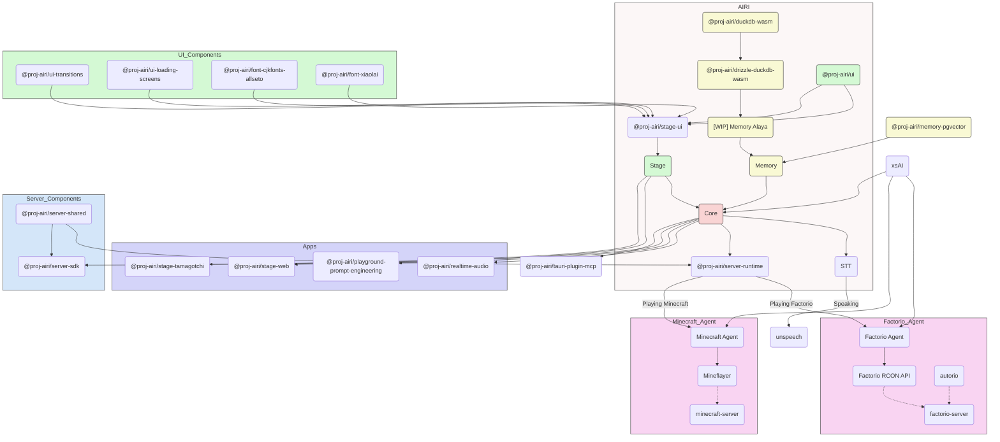

<picture>
  <source
    width="100%"
    srcset="./docs/content/public/banner-dark-1280x640.avif"
    media="(prefers-color-scheme: dark)"
  />
  <source
    width="100%"
    srcset="./docs/content/public/banner-light-1280x640.avif"
    media="(prefers-color-scheme: light), (prefers-color-scheme: no-preference)"
  />
  
</picture>

<h1 align="center">Project AIRI</h1>

<p align="center">Re-creating Neuro-sama, a soul container of AI waifu / virtual characters to bring them into our world.</p>

<p align="center">
  [<a href="https://discord.gg/TgQ3Cu2F7A">Join Discord Server</a>] [<a href="https://airi.moeru.ai">Try it</a>] [<a href="https://github.com/moeru-ai/airi/blob/main/docs/README.zh-CN.md">简体中文</a>] [<a href="https://github.com/moeru-ai/airi/blob/main/docs/README.ja-JP.md">日本語</a>] [<a href="https://github.com/moeru-ai/airi/blob/main/docs/README.ru-RU.md">Русский</a>] [<a href="https://github.com/moeru-ai/airi/blob/main/docs/README.vi.md">Tiếng Việt</a>] [<a href="https://github.com/moeru-ai/airi/blob/main/docs/README.fr.md">Français</a>]
</p>

<p align="center">
  <a href="https://deepwiki.com/moeru-ai/airi"></a>
  <a href="https://github.com/moeru-ai/airi/blob/main/LICENSE"></a>
  <a href="https://discord.gg/TgQ3Cu2F7A"></a>
  <a href="https://x.com/proj_airi"></a>
  <a href="https://t.me/+7M_ZKO3zUHFlOThh"></a>
  <a href="./docs/wechat.md"></a>
  <a href="https://qun.qq.com/universal-share/share?ac=1&authKey=9g00d%2BZS7nORzcJugNNddJ7rCghZTIR7fhXabGwch2S%2BG%2BKGIKwlN1N2nIqkh2jg&busi_data=eyJncm91cENvZGUiOiIxMDU4MTU2Njk3IiwidG9rZW4iOiJmcnkra1hWNFIxNytEcG0zcHRUdVJIaldlRDFxN0dzK080QWtvTEdOQjJkNEY2eUFta1g1clNpbkxSMS9FQWFYIiwidWluIjoiMTI2MDkwNzMzNSJ9&data=b1eJrwn3GVOUh7YIxZ7l9vHQo99HPmRxKPpMKlDCmfzx8Y57IXb2EZCMaOC9rVTd2U558qpNjwUYUWlPHxVHvg&svctype=4&tempid=h5_group_info"></a>
</p>

<p align="center">
  <a href="https://www.producthunt.com/products/airi?embed=true&utm_source=badge-featured&utm_medium=badge&utm_source=badge-airi" target="_blank"></a>
  <a href="https://trendshift.io/repositories/14636" target="_blank"></a>
</p>

> Heavily inspired by [Neuro-sama](https://www.youtube.com/@Neurosama)

> [!WARNING]
> **Attention:** We **do not** have any officially minted cryptocurrency or token associated with this project. Please check the information and proceed with caution.

> [!NOTE]
>
> We've got a whole dedicated organization [@proj-airi](https://github.com/proj-airi) for all the sub-projects born from Project AIRI. Check it out!
>
> RAG, memory system, embedded database, icons, Live2D utilities, and more!

> [!TIP]
> We have a translation project on [Crowdin](https://crowdin.com/project/proj-airi). If you find any inaccurate translations, feel free to contribute improvements there.
> <a href="https://crowdin.com/project/proj-airi" target="_blank" rel="nofollow"></a>

Have you dreamed about having a cyber living being (cyber waifu, digital pet) or digital companion that could play with and talk to you?

With the power of modern large language models like [ChatGPT](https://chatgpt.com) and famous [Claude](https://claude.ai), asking a virtual being to roleplay and chat with us is already easy enough for everyone. Platforms like [Character.ai (a.k.a. c.ai)](https://character.ai) and [JanitorAI](https://janitorai.com/) as well as local playgrounds like [SillyTavern](https://github.com/SillyTavern/SillyTavern) are already good-enough solutions for a chat based or visual adventure game like experience.

> But, what about the abilities to play games? And see what you are coding at? Chatting while playing games, watching videos, and is capable of doing many other things.

Perhaps you know [Neuro-sama](https://www.youtube.com/@Neurosama) already. She is currently the best virtual streamer capable of playing games, chatting, and interacting with you and the participants. Some also call this kind of being "digital human." **Sadly, as it's not open sourced, you cannot interact with her after her live streams go offline**.

Therefore, this project, AIRI, offers another possibility here: **let you own your digital life, cyber living, easily, anywhere, anytime**.

## DevLogs We Posted & Recent Updates

- [DevLog @ 2026.01.01](https://airi.moeru.ai/docs/en/blog/DevLog-2026.01.01/) on January 1, 2026
- [DevLog @ 2025.10.20](https://airi.moeru.ai/docs/en/blog/DevLog-2025.10.20/) on October 20, 2025
- [DevLog @ 2025.08.05](https://airi.moeru.ai/docs/en/blog/DevLog-2025.08.05/) on August 5, 2025
- [DevLog @ 2025.08.01](https://airi.moeru.ai/docs/en/blog/DevLog-2025.08.01/) on August 1, 2025
- [DevLog @ 2025.07.18](https://airi.moeru.ai/docs/en/blog/DevLog-2025.07.18/) on July 18, 2025
- [DreamLog 0x1](https://airi.moeru.ai/docs/en/blog/dreamlog-0x1/) on June 16, 2025
- ...more on [documentation site](https://airi.moeru.ai/docs/en/)

## What's So Special About This Project?

Unlike the other AI driven VTuber open source projects, アイリ was built with support of many Web technologies such as [WebGPU](https://www.w3.org/TR/webgpu/), [WebAudio](https://developer.mozilla.org/en-US/docs/Web/API/Web_Audio_API), [Web Workers](https://developer.mozilla.org/en-US/docs/Web/API/Web_Workers_API/Using_web_workers), [WebAssembly](https://webassembly.org/), [WebSocket](https://developer.mozilla.org/en-US/docs/Web/API/WebSocket), etc. from the first day.

> [!TIP]
> Worrying about the performance drop since we are using Web related technologies?
>
> Don't worry, while Web browser version is meant to give an insight about how much we can push and do inside browsers, and webviews, we will never fully rely on this, the desktop version of AIRI is capable of using native [NVIDIA CUDA](https://developer.nvidia.com/cuda-toolkit) and [Apple Metal](https://developer.apple.com/metal/) by default (thanks to HuggingFace & beloved [candle](https://github.com/huggingface/candle) project), without any complex dependency managements, considering the tradeoff, it was partially powered by Web technologies for graphics, layouts, animations, and the WIP plugin systems for everyone to integrate things.

This means that **アイリ is capable of running on modern browsers and devices** and even on mobile devices (already done with PWA support). This brings a lot of possibilities for us (the developers) to build and extend the power of アイリ VTuber to the next level, while still leaving the flexibilities for users to enable features that requires TCP connections or other non-Web technologies such as connecting to a Discord voice channel or playing Minecraft and Factorio with friends.

> [!NOTE]
>
> We are still in the early stage of development where we are seeking out talented developers to join us and help us to make アイリ a reality.
>
> It's ok if you are not familiar with Vue.js, TypeScript, and devtools required for this project, you can join us as an artist, designer, or even help us to launch our first live stream.
>
> Even if you are a big fan of React, Svelte or even Solid, we welcome you. You can open a sub-directory to add features that you want to see in アイリ, or would like to experiment with.
>
> Fields (and related projects) that we are looking for:
>
> - Live2D modeller
> - VRM modeller
> - VRChat avatar designer
> - Computer Vision
> - Reinforcement Learning
> - Speech Recognition
> - Speech Synthesis
> - ONNX Runtime
> - Transformers.js
> - vLLM
> - WebGPU
> - Three.js
> - WebXR ([checkout the another project](https://github.com/moeru-ai/chat) we have under the @moeru-ai organization)
>
> **If you are interested, why not introduce yourself here? [Would like to join part of us to build AIRI?](https://github.com/moeru-ai/airi/discussions/33)**

## Current Progress

Capable of

- [x] Brain
  - [x] Play [Minecraft](https://www.minecraft.net)
  - [x] Play [Factorio](https://www.factorio.com) (WIP, but [PoC and demo available](https://github.com/moeru-ai/airi-factorio))
  - [x] Chat in [Telegram](https://telegram.org)
  - [x] Chat in [Discord](https://discord.com)
  - [ ] Memory
    - [x] Pure in-browser database support (DuckDB WASM | `pglite`)
    - [ ] Memory Alaya (WIP)
  - [ ] Pure in-browser local (WebGPU) inference
- [x] Ears
  - [x] Audio input from browser
  - [x] Audio input from [Discord](https://discord.com)
  - [x] Client side speech recognition
  - [x] Client side talking detection
- [x] Mouth
  - [x] [ElevenLabs](https://elevenlabs.io/) voice synthesis
- [x] Body
  - [x] VRM support
    - [x] Control VRM model
  - [x] VRM model animations
    - [x] Auto blink
    - [x] Auto look at
    - [x] Idle eye movement
  - [x] Live2D support
    - [x] Control Live2D model
  - [x] Live2D model animations
    - [x] Auto blink
    - [x] Auto look at
    - [x] Idle eye movement

## Development

> For detailed instructions to develop this project, follow [CONTRIBUTING.md](./.github/CONTRIBUTING.md)

> [!NOTE]
> By default, `pnpm dev` will start the development server for the Stage Web (browser version). If you would
> like to try developing the desktop version, please make sure you read [CONTRIBUTING.md](./.github/CONTRIBUTING.md)
> to setup the environment correctly.

```shell
pnpm i
pnpm dev
```

### Stage Web (Browser Version at [airi.moeru.ai](https://airi.moeru.ai))

```shell
pnpm dev
```

### Stage Tamagotchi (Desktop Version)

```shell
pnpm dev:tamagotchi
```

A Nix package for Tamagotchi is included. To run airi with Nix, first make sure to enable flakes, then run:

```shell
nix run github:moeru-ai/airi
```

### Stage Capacitor (Mobile Version)

Start the development server for the capacitor web version:

```shell
pnpm dev:capacitor
```

Check your IP address in the output of the command above:

```shell
  ROLLDOWN-VITE v7.3.0  ready in 1073 ms

  ➜  Local:   https://localhost:5273/
  ➜  Network: https://<ip-will-be-here>:5273/
  ➜  Vue DevTools: Open https://localhost:5273/__devtools__/ as a separate window
  ➜  Vue DevTools: Press Option(⌥)+Shift(⇧)+D in App to toggle the Vue DevTools
  ➜  UnoCSS Inspector: https://localhost:5273/__unocss/
```

Open the Xcode project:

```shell
CAPACITOR_DEV_SERVER_URL=https://<your-ip-address>:5273 pnpm open:ios
```

Then Xcode will open and you can click the "Run" button to run the app on your iPhone.

### Documentation Site

```shell
pnpm dev:docs
```

### Publish

Please update the version in `Cargo.toml` after running `bumpp`:

```shell
npx bumpp --no-commit --no-tag
```

## Support of LLM API Providers (powered by [xsai](https://github.com/moeru-ai/xsai))

- [x] [302.AI (sponsored)](https://share.302.ai/514k2v)
- [x] [OpenRouter](https://openrouter.ai/)
- [x] [vLLM](https://github.com/vllm-project/vllm)
- [x] [SGLang](https://github.com/sgl-project/sglang)
- [x] [Ollama](https://github.com/ollama/ollama)
- [x] [Google Gemini](https://developers.generativeai.google)
- [x] [OpenAI](https://platform.openai.com/docs/guides/gpt/chat-completions-api)
  - [ ] [Azure OpenAI API](https://learn.microsoft.com/en-us/azure/ai-services/openai/reference) (PR welcome)
- [x] [Anthropic Claude](https://anthropic.com)
  - [ ] [AWS Claude](https://docs.anthropic.com/en/api/claude-on-amazon-bedrock) (PR welcome)
- [x] [DeepSeek](https://www.deepseek.com/)
- [x] [Qwen](https://help.aliyun.com/document_detail/2400395.html)
- [x] [xAI](https://x.ai/)
- [x] [Groq](https://wow.groq.com/)
- [x] [Mistral](https://mistral.ai/)
- [x] [Cloudflare Workers AI](https://developers.cloudflare.com/workers-ai/)
- [x] [Together.ai](https://www.together.ai/)
- [x] [Fireworks.ai](https://www.together.ai/)
- [x] [Novita](https://www.novita.ai/)
- [x] [Zhipu](https://bigmodel.cn)
- [x] [SiliconFlow](https://cloud.siliconflow.cn/i/rKXmRobW)
- [x] [Stepfun](https://platform.stepfun.com/)
- [x] [Baichuan](https://platform.baichuan-ai.com)
- [x] [Minimax](https://api.minimax.chat/)
- [x] [Moonshot AI](https://platform.moonshot.cn/)
- [x] [ModelScope](https://modelscope.cn/docs/model-service/API-Inference/intro)
- [x] [Player2](https://player2.game/)
- [x] [Tencent Cloud](https://cloud.tencent.com/document/product/1729)
- [ ] [Sparks](https://www.xfyun.cn/doc/spark/Web.html) (PR welcome)
- [ ] [Volcano Engine](https://www.volcengine.com/experience/ark?utm_term=202502dsinvite&ac=DSASUQY5&rc=2QXCA1VI) (PR welcome)

## Sub-projects Born from This Project

- [Awesome AI VTuber](https://github.com/proj-airi/awesome-ai-vtuber): A curated list of AI VTubers and related projects
- [`unspeech`](https://github.com/moeru-ai/unspeech): Universal endpoint proxy server for `/audio/transcriptions` and `/audio/speech`, like LiteLLM but for any ASR and TTS
- [`hfup`](https://github.com/moeru-ai/hfup): tools to help on deploying, bundling to HuggingFace Spaces
- [`xsai-transformers`](https://github.com/moeru-ai/xsai-transformers): Experimental [🤗 Transformers.js](https://github.com/huggingface/transformers.js) provider for [xsAI](https://github.com/moeru-ai/xsai).
- [WebAI: Realtime Voice Chat](https://github.com/proj-airi/webai-realtime-voice-chat): Full example of implementing ChatGPT's realtime voice from scratch with VAD + STT + LLM + TTS.
- [`@proj-airi/drizzle-duckdb-wasm`](https://github.com/moeru-ai/airi/tree/main/packages/drizzle-duckdb-wasm/README.md): Drizzle ORM driver for DuckDB WASM
- [`@proj-airi/duckdb-wasm`](https://github.com/moeru-ai/airi/tree/main/packages/duckdb-wasm/README.md): Easy to use wrapper for `@duckdb/duckdb-wasm`
- [`tauri-plugin-mcp`](https://github.com/moeru-ai/airi/blob/main/crates/tauri-plugin-mcp/README.md): A Tauri plugin for interacting with MCP servers.
- [AIRI Factorio](https://github.com/moeru-ai/airi-factorio): Allow AIRI to play Factorio
- [Factorio RCON API](https://github.com/nekomeowww/factorio-rcon-api): RESTful API wrapper for Factorio headless server console
- [`autorio`](https://github.com/moeru-ai/airi-factorio/tree/main/packages/autorio): Factorio automation library
- [`tstl-plugin-reload-factorio-mod`](https://github.com/moeru-ai/airi-factorio/tree/main/packages/tstl-plugin-reload-factorio-mod): Reload Factorio mod when developing
- [Velin](https://github.com/luoling8192/velin): Use Vue SFC and Markdown to write easy to manage stateful prompts for LLM
- [`demodel`](https://github.com/moeru-ai/demodel): Easily boost the speed of pulling your models and datasets from various of inference runtimes.
- [`inventory`](https://github.com/moeru-ai/inventory): Centralized model catalog and default provider configurations backend service
- [MCP Launcher](https://github.com/moeru-ai/mcp-launcher): Easy to use MCP builder & launcher for all possible MCP servers, just like Ollama for models!
- [🥺 SAD](https://github.com/moeru-ai/sad): Documentation and notes for self-host and browser running LLMs.



## Similar Projects

### Open sourced ones

- [kimjammer/Neuro: A recreation of Neuro-Sama originally created in 7 days.](https://github.com/kimjammer/Neuro): very well completed implementation.
- [SugarcaneDefender/z-waif](https://github.com/SugarcaneDefender/z-waif): Great at gaming, autonomous, and prompt engineering
- [semperai/amica](https://github.com/semperai/amica/): Great at VRM, WebXR
- [elizaOS/eliza](https://github.com/elizaOS/eliza): Great examples and software engineering on how to integrate agent into various of systems and APIs
- [ardha27/AI-Waifu-Vtuber](https://github.com/ardha27/AI-Waifu-Vtuber): Great about Twitch API integrations
- [InsanityLabs/AIVTuber](https://github.com/InsanityLabs/AIVTuber): Nice UI and UX
- [IRedDragonICY/vixevia](https://github.com/IRedDragonICY/vixevia)
- [t41372/Open-LLM-VTuber](https://github.com/t41372/Open-LLM-VTuber)
- [PeterH0323/Streamer-Sales](https://github.com/PeterH0323/Streamer-Sales)

### Non-open-sourced ones

- https://clips.twitch.tv/WanderingCaringDeerDxCat-Qt55xtiGDSoNmDDr https://www.youtube.com/watch?v=8Giv5mupJNE
- https://clips.twitch.tv/TriangularAthleticBunnySoonerLater-SXpBk1dFso21VcWD
- https://www.youtube.com/@NOWA_Mirai

## Project Status


## Acknowledgements

- [Reka UI](https://github.com/unovue/reka-ui): for designing the documentation site, the new landing page is based on this, as well as implementing a massive amount of UI components. (shadcn-vue is using Reka UI as the headless, do checkout!)
- [pixiv/ChatVRM](https://github.com/pixiv/ChatVRM)
- [josephrocca/ChatVRM-js: A JS conversion/adaptation of parts of the ChatVRM (TypeScript) code for standalone use in OpenCharacters and elsewhere](https://github.com/josephrocca/ChatVRM-js)
- Design of UI and style was inspired by [Cookard](https://store.steampowered.com/app/2919650/Cookard/), [UNBEATABLE](https://store.steampowered.com/app/2240620/UNBEATABLE/), and [Sensei! I like you so much!](https://store.steampowered.com/app/2957700/_/), and artworks of [Ayame by Mercedes Bazan](https://dribbble.com/shots/22157656-Ayame) with [Wish by Mercedes Bazan](https://dribbble.com/shots/24501019-Wish)
- [mallorbc/whisper_mic](https://github.com/mallorbc/whisper_mic)
- [`xsai`](https://github.com/moeru-ai/xsai): Implemented a decent amount of packages to interact with LLMs and models, like [Vercel AI SDK](https://sdk.vercel.ai/) but way small.

## Star History

[](https://www.star-history.com/#moeru-ai/airi&Date)
