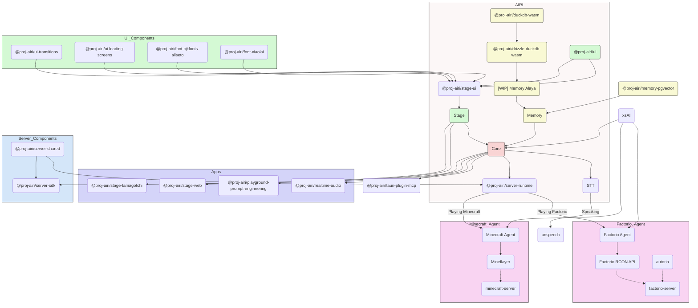

<picture>
  <source
    width="100%"
    srcset="./content/public/banner-dark-1280x640.avif"
    media="(prefers-color-scheme: dark)"
  />
  <source
    width="100%"
    srcset="./content/public/banner-light-1280x640.avif"
    media="(prefers-color-scheme: light), (prefers-color-scheme: no-preference)"
  />
  
</picture>

<h1 align="center">Projet AIRI</h1>

<p align="center">Re-création de Neuro-sama, un conteneur d'âme pour waifu / personnages virtuels IA afin de les amener dans notre monde.</p>

<p align="center">
  [<a href="https://discord.gg/TgQ3Cu2F7A">Rejoindre le serveur Discord</a>] [<a href="https://airi.moeru.ai">Essayez-le</a>] [<a href="https://github.com/moeru-ai/airi/blob/main/docs/README.zh-CN.md">简体中文</a>] [<a href="https://github.com/moeru-ai/airi/blob/main/docs/README.ja-JP.md">日本語</a>] [<a href="https://github.com/moeru-ai/airi/blob/main/docs/README.ru-RU.md">Русский</a>] [<a href="https://github.com/moeru-ai/airi/blob/main/docs/README.vi.md">Tiếng Việt</a>] [<a href="https://github.com/moeru-ai/airi/blob/main/docs/README.fr.md">Français</a>]
</p>

<p align="center">
  <a href="https://deepwiki.com/moeru-ai/airi"></a>
  <a href="https://github.com/moeru-ai/airi/blob/main/LICENSE"></a>
  <a href="https://discord.gg/TgQ3Cu2F7A"></a>
  <a href="https://x.com/proj_airi"></a>
  <a href="https://t.me/+7M_ZKO3zUHFlOThh"></a>
  <a href="./wechat.md"></a>
  <a href="https://qun.qq.com/universal-share/share?ac=1&authKey=9g00d%2BZS7nORzcJugNNddJ7rCghZTIR7fhXabGwch2S%2BG%2BKGIKwlN1N2nIqkh2jg&busi_data=eyJncm91cENvZGUiOiIxMDU4MTU2Njk3IiwidG9rZW4iOiJmcnkra1hWNFIxNytEcG0zcHRUdVJIaldlRDFxN0dzK080QWtvTEdOQjJkNEY2eUFta1g1clNpbkxSMS9FQWFYIiwidWluIjoiMTI2MDkwNzMzNSJ9&data=b1eJrwn3GVOUh7YIxZ7l9vHQo99HPmRxKPpMKlDCmfzx8Y57IXb2EZCMaOC9rVTd2U558qpNjwUYUWlPHxVHvg&svctype=4&tempid=h5_group_info"></a>
</p>

<p align="center">
  <a href="https://www.producthunt.com/products/airi?embed=true&utm_source=badge-featured&utm_medium=badge&utm_source=badge-airi" target="_blank"></a>
  <a href="https://trendshift.io/repositories/14636" target="_blank"></a>
</p>

> Fortement inspiré par [Neuro-sama](https://www.youtube.com/@Neurosama)

> [!WARNING]
> **Attention :** Nous **n'avons pas** de crypto-monnaie ou de token officiel associé à ce projet. Veuillez vérifier les informations et procéder avec prudence.

> [!NOTE]
>
> Nous avons une organisation dédiée [@proj-airi](https://github.com/proj-airi) pour tous les sous-projets issus du Projet AIRI. Découvrez-la !
>
> RAG, système de mémoire, base de données intégrée, icônes, utilitaires Live2D, et plus encore !

> [!TIP]
> Nous avons un projet de traduction sur [Crowdin](https://crowdin.com/project/proj-airi). Si vous repérez une traduction inexacte, n’hésitez pas à contribuer ou à proposer une correction sur Crowdin.
> <a href="https://crowdin.com/project/proj-airi" target="_blank" rel="nofollow"></a>

Avez-vous rêvé d’avoir un être cyber vivant (waifu numérique, animal de compagnie digital) ou un compagnon numérique avec lequel jouer et discuter ?

Avec la puissance des modèles de langage modernes comme [ChatGPT](https://chatgpt.com) et le célèbre [Claude](https://claude.ai), demander à un être virtuel de jouer un rôle et de discuter est déjà simple pour tout le monde. Des plateformes comme [Character.ai (c.ai)](https://character.ai) et [JanitorAI](https://janitorai.com/) ainsi que des playgrounds locaux comme [SillyTavern](https://github.com/SillyTavern/SillyTavern) offrent déjà des solutions assez bonnes pour une expérience de chat ou de jeu d’aventure visuel.

> Mais qu’en est-il de la possibilité de jouer à des jeux et de voir ce que vous codez ? Discuter tout en jouant à des jeux, en regardant des vidéos, et être capable de faire beaucoup d’autres choses.

Peut-être connaissez-vous déjà [Neuro-sama](https://www.youtube.com/@Neurosama). Elle est actuellement la meilleure VTuber virtuelle capable de jouer, discuter et interagir avec vous et les participants. Certains appellent ce type d’être « humain digital ». **Malheureusement, comme ce n’est pas open source, vous ne pouvez pas interagir avec elle après la fin de ses streams.**

Ainsi, ce projet AIRI offre une autre possibilité : **vous permettre de posséder votre vie digitale, votre cyber-vie, facilement, partout et à tout moment**.

## Journaux de développement et mises à jour récentes

- [DevLog @ 01.01.2026](https://airi.moeru.ai/docs/en/blog/DevLog-2026.01.01/) du 1er janvier 2026
- [DevLog @ 20.10.2025](https://airi.moeru.ai/docs/en/blog/DevLog-2025.10.20/) du 20 octobre 2025
- [DevLog @ 05.08.2025](https://airi.moeru.ai/docs/en/blog/DevLog-2025.08.05/) du 5 août 2025
- [DevLog @ 01.08.2025](https://airi.moeru.ai/docs/en/blog/DevLog-2025.08.01/) du 1er août 2025
- [DevLog @ 18.07.2025](https://airi.moeru.ai/docs/en/blog/DevLog-2025.07.18/) du 18 juillet 2025
- [DreamLog 0x1](https://airi.moeru.ai/docs/en/blog/dreamlog-0x1/) du 16 juin 2025
- ...plus sur le [site de documentation](https://airi.moeru.ai/docs)

## Qu’est-ce qui rend ce projet spécial ?

Contrairement aux autres projets open source VTuber basés sur l’IA, アイリ a été construit dès le départ avec le support de nombreuses technologies Web comme [WebGPU](https://www.w3.org/TR/webgpu/), [WebAudio](https://developer.mozilla.org/en-US/docs/Web/API/Web_Audio_API), [Web Workers](https://developer.mozilla.org/en-US/docs/Web/API/Web_Workers_API/Using_web_workers), [WebAssembly](https://webassembly.org/), [WebSocket](https://developer.mozilla.org/en-US/docs/Web/API/WebSocket), etc.

> [!TIP]
> Vous vous inquiétez de la baisse de performance due aux technologies Web ?
>
> Ne vous inquiétez pas, même si la version navigateur est faite pour montrer jusqu’où nous pouvons aller dans un navigateur ou un webview, la version desktop d’AIRI peut utiliser nativement [NVIDIA CUDA](https://developer.nvidia.com/cuda-toolkit) et [Apple Metal](https://developer.apple.com/metal/) par défaut, grâce à HuggingFace et le projet adoré [candle](https://github.com/huggingface/candle), sans gestion complexe de dépendances. Les technologies Web sont surtout utilisées pour les graphismes, les layouts, les animations et le système de plugins en WIP.

Cela signifie qu’**アイリ peut fonctionner sur les navigateurs modernes et les appareils mobiles** (déjà testé avec support PWA). Cela ouvre beaucoup de possibilités pour nous (les développeurs) de construire et étendre le potentiel du VTuber アイリ, tout en laissant aux utilisateurs la flexibilité d’activer des fonctionnalités nécessitant des connexions TCP ou d’autres technologies non-Web comme Discord ou jouer à Minecraft et Factorio avec des amis.

> [!NOTE]
>
> Nous sommes encore au début du développement et cherchons des développeurs talentueux pour rejoindre le projet et aider à concrétiser アイリ.
>
> Pas besoin de maîtriser Vue.js, TypeScript ou les devtools nécessaires pour ce projet, vous pouvez rejoindre comme artiste, designer, ou même pour aider à lancer notre premier live.
>
> Même si vous aimez React, Svelte ou Solid, vous êtes les bienvenus. Vous pouvez ajouter un sous-répertoire pour expérimenter ou ajouter des fonctionnalités que vous souhaitez voir dans アイリ.
>
> Domaines et projets associés recherchés :
>
> - Modeleur Live2D
> - Modeleur VRM
> - Designer d’avatar VRChat
> - Vision par ordinateur
> - Apprentissage par renforcement
> - Reconnaissance vocale
> - Synthèse vocale
> - ONNX Runtime
> - Transformers.js
> - vLLM
> - WebGPU
> - Three.js
> - WebXR ([voir un autre projet](https://github.com/moeru-ai/chat))
>
> **Si vous êtes intéressé, pourquoi ne pas vous présenter ici ? [Voulez-vous rejoindre AIRI ?](https://github.com/moeru-ai/airi/discussions/33)**

## Progrès actuels

Capacités :

- [x] Cerveau
  - [x] Jouer à [Minecraft](https://www.minecraft.net)
  - [x] Jouer à [Factorio](https://www.factorio.com) (WIP, mais [PoC et démo disponibles](https://github.com/moeru-ai/airi-factorio))
  - [x] Chat sur [Telegram](https://telegram.org)
  - [x] Chat sur [Discord](https://discord.com)
  - [ ] Mémoire
    - [x] Support base de données purement navigateur (DuckDB WASM | `pglite`)
    - [ ] Mémoire Alaya (WIP)
  - [ ] Inférence locale pure en navigateur (WebGPU)
- [x] Oreilles
  - [x] Entrée audio depuis le navigateur
  - [x] Entrée audio depuis [Discord](https://discord.com)
  - [x] Reconnaissance vocale côté client
  - [x] Détection de parole côté client
- [x] Bouche
  - [x] Synthèse vocale [ElevenLabs](https://elevenlabs.io/)
- [x] Corps
  - [x] Support VRM
    - [x] Contrôle du modèle VRM
  - [x] Animations modèle VRM
    - [x] Clignement automatique
    - [x] Suivi automatique du regard
    - [x] Mouvement oculaire au repos
  - [x] Support Live2D
    - [x] Contrôle modèle Live2D
  - [x] Animations modèle Live2D
    - [x] Clignement automatique
    - [x] Suivi automatique du regard
    - [x] Mouvement oculaire au repos

## Développement

> Pour des instructions détaillées sur le développement, suivez [CONTRIBUTING.md](./.github/CONTRIBUTING.md)

> [!NOTE]
> Par défaut, `pnpm dev` démarre le serveur de développement pour Stage Web (version navigateur). Pour développer la version desktop, lisez [CONTRIBUTING.md](./.github/CONTRIBUTING.md) pour configurer correctement l’environnement.

```shell
pnpm i
pnpm dev
```

### Stage Web (Version navigateur sur [airi.moeru.ai](https://airi.moeru.ai))

```shell
pnpm dev
```

### Stage Tamagotchi (Version Bureau)

```shell
pnpm dev:tamagotchi
```

Un package Nix pour Tamagotchi est inclus. Pour lancer AIRI avec Nix, assurez-vous d'abord d'activer les flakes, puis exécutez :

```shell
nix run github:moeru-ai/airi
```

### Site de la Documentation

```shell
pnpm dev:docs
```

### Publier

Merci de mettre à jour la version dans `Cargo.toml` après avoir exécuté `bumpp` :

```shell
npx bumpp --no-commit --no-tag
```

## Support des fournisseurs d'API LLM suivants (propulsé par [xsai](https://github.com/moeru-ai/xsai))

- [x] [302.AI](https://share.302.ai/514k2v)
- [x] [OpenRouter](https://openrouter.ai/)
- [x] [vLLM](https://github.com/vllm-project/vllm)
- [x] [SGLang](https://github.com/sgl-project/sglang)
- [x] [Ollama](https://github.com/ollama/ollama)
- [x] [Google Gemini](https://developers.generativeai.google)
- [x] [OpenAI](https://platform.openai.com/docs/guides/gpt/chat-completions-api)
  - [ ] [Azure OpenAI API](https://learn.microsoft.com/en-us/azure/ai-services/openai/reference) (PR bienvenue)
- [x] [Anthropic Claude](https://anthropic.com)
  - [ ] [AWS Claude](https://docs.anthropic.com/en/api/claude-on-amazon-bedrock) (PR bienvenue)
- [x] [DeepSeek](https://www.deepseek.com/)
- [x] [Qwen](https://help.aliyun.com/document_detail/2400395.html)
- [x] [xAI](https://x.ai/)
- [x] [Groq](https://wow.groq.com/)
- [x] [Mistral](https://mistral.ai/)
- [x] [Cloudflare Workers AI](https://developers.cloudflare.com/workers-ai/)
- [x] [Together.ai](https://www.together.ai/)
- [x] [Fireworks.ai](https://www.together.ai/)
- [x] [Novita](https://www.novita.ai/)
- [x] [Zhipu](https://bigmodel.cn)
- [x] [SiliconFlow](https://cloud.siliconflow.cn/i/rKXmRobW)
- [x] [Stepfun](https://platform.stepfun.com/)
- [x] [Baichuan](https://platform.baichuan-ai.com)
- [x] [Minimax](https://api.minimax.chat/)
- [x] [Moonshot AI](https://platform.moonshot.cn/)
- [x] [Player2](https://player2.game/)
- [x] [Tencent Cloud](https://cloud.tencent.com/document/product/1729)
- [ ] [Sparks](https://www.xfyun.cn/doc/spark/Web.html) (PR bienvenue)
- [ ] [Volcano Engine](https://www.volcengine.com/experience/ark?utm_term=202502dsinvite&ac=DSASUQY5&rc=2QXCA1VI) (PR bienvenue)

## Sous-projets issus de ce projet

- [Awesome AI VTuber](https://github.com/proj-airi/awesome-ai-vtuber) : Liste sélectionnée d’AI VTubers et projets associés
- [`unspeech`](https://github.com/moeru-ai/unspeech) : Proxy universel pour `/audio/transcriptions` et `/audio/speech`, similaire à LiteLLM mais pour n’importe quel ASR et TTS
- [`hfup`](https://github.com/moeru-ai/hfup) : Outils pour déployer et packager sur HuggingFace Spaces
- [`xsai-transformers`](https://github.com/moeru-ai/xsai-transformers) : Fournisseur expérimental [🤗 Transformers.js](https://github.com/huggingface/transformers.js) pour [xsAI](https://github.com/moeru-ai/xsai)
- [WebAI : Chat vocal en temps réel](https://github.com/proj-airi/webai-realtime-voice-chat) : Exemple complet d’implémentation de la voix temps réel de ChatGPT avec VAD + STT + LLM + TTS
- [`@proj-airi/drizzle-duckdb-wasm`](https://github.com/moeru-ai/airi/tree/main/packages/drizzle-duckdb-wasm/README.md) : Driver Drizzle ORM pour DuckDB WASM
- [`@proj-airi/duckdb-wasm`](https://github.com/moeru-ai/airi/tree/main/packages/duckdb-wasm/README.md) : Wrapper facile à utiliser pour `@duckdb/duckdb-wasm`
- [`tauri-plugin-mcp`](https://github.com/moeru-ai/airi/blob/main/crates/tauri-plugin-mcp/README.md) : Plugin Tauri pour interagir avec les serveurs MCP
- [AIRI Factorio](https://github.com/moeru-ai/airi-factorio) : Permet à AIRI de jouer à Factorio
- [Factorio RCON API](https://github.com/nekomeowww/factorio-rcon-api) : Wrapper RESTful pour la console headless de Factorio
- [`autorio`](https://github.com/moeru-ai/airi-factorio/tree/main/packages/autorio) : Bibliothèque d’automatisation pour Factorio
- [`tstl-plugin-reload-factorio-mod`](https://github.com/moeru-ai/airi-factorio/tree/main/packages/tstl-plugin-reload-factorio-mod) : Recharge le mod Factorio pendant le développement
- [Velin](https://github.com/luoling8192/velin) : Utilise Vue SFC et Markdown pour créer facilement des prompts stateful pour LLM
- [`demodel`](https://github.com/moeru-ai/demodel) : Accélère le téléchargement de vos modèles et datasets depuis différents runtimes
- [`inventory`](https://github.com/moeru-ai/inventory) : Service backend centralisé pour catalogues de modèles et configurations par défaut
- [MCP Launcher](https://github.com/moeru-ai/mcp-launcher) : Constructeur & lanceur MCP facile à utiliser pour tous les serveurs MCP, comme Ollama pour les modèles
- [🥺 SAD](https://github.com/moeru-ai/sad) : Documentation et notes pour LLMs auto-hébergés et en navigateur



## Projets similaires

### Open source

- [kimjammer/Neuro : Recréation de Neuro-Sama créée à l'origine en 7 jours](https://github.com/kimjammer/Neuro) : implémentation très complète
- [SugarcaneDefender/z-waif](https://github.com/SugarcaneDefender/z-waif) : Très bon pour le gaming, autonome, et prompt engineering
- [semperai/amica](https://github.com/semperai/amica) : Excellent pour VRM et WebXR
- [elizaOS/eliza](https://github.com/elizaOS/eliza) : Bons exemples et ingénierie logicielle pour intégrer un agent dans différents systèmes et APIs
- [ardha27/AI-Waifu-Vtuber](https://github.com/ardha27/AI-Waifu-Vtuber) : Intégrations Twitch API efficaces
- [InsanityLabs/AIVTuber](https://github.com/InsanityLabs/AIVTuber) : UI et UX agréables
- [IRedDragonICY/vixevia](https://github.com/IRedDragonICY/vixevia)
- [t41372/Open-LLM-VTuber](https://github.com/t41372/Open-LLM-VTuber)
- [PeterH0323/Streamer-Sales](https://github.com/PeterH0323/Streamer-Sales)

### Non open source

- https://clips.twitch.tv/WanderingCaringDeerDxCat-Qt55xtiGDSoNmDDr
  https://www.youtube.com/watch?v=8Giv5mupJNE
- https://clips.twitch.tv/TriangularAthleticBunnySoonerLater-SXpBk1dFso21VcWD
- https://www.youtube.com/@NOWA_Mirai

## État du projet


## Remerciements

- [Reka UI](https://github.com/unovue/reka-ui) : pour la conception du site de documentation, la nouvelle page d'accueil est basée sur celui-ci, ainsi que l’implémentation de nombreux composants UI (shadcn-vue utilise Reka UI comme headless)
- [pixiv/ChatVRM](https://github.com/pixiv/ChatVRM)
- [josephrocca/ChatVRM-js : conversion/adaptation JS de parties du code ChatVRM (TypeScript) pour utilisation autonome dans OpenCharacters et ailleurs](https://github.com/josephrocca/ChatVRM-js)
- Le design de l’UI et du style s’inspire de [Cookard](https://store.steampowered.com/app/2919650/Cookard/), [UNBEATABLE](https://store.steampowered.com/app/2240620/UNBEATABLE/), [Sensei! I like you so much!](https://store.steampowered.com/app/2957700/_/) et des œuvres de [Ayame par Mercedes Bazan](https://dribbble.com/shots/22157656-Ayame) avec [Wish par Mercedes Bazan](https://dribbble.com/shots/24501019-Wish)
- [mallorbc/whisper_mic](https://github.com/mallorbc/whisper_mic)
- [`xsai`](https://github.com/moeru-ai/xsai) : Implémente un bon nombre de packages pour interagir avec des LLM et modèles, similaire à [Vercel AI SDK](https://sdk.vercel.ai/) mais plus léger.

## Historique des étoiles

[](https://www.star-history.com/#moeru-ai/airi&Date)
