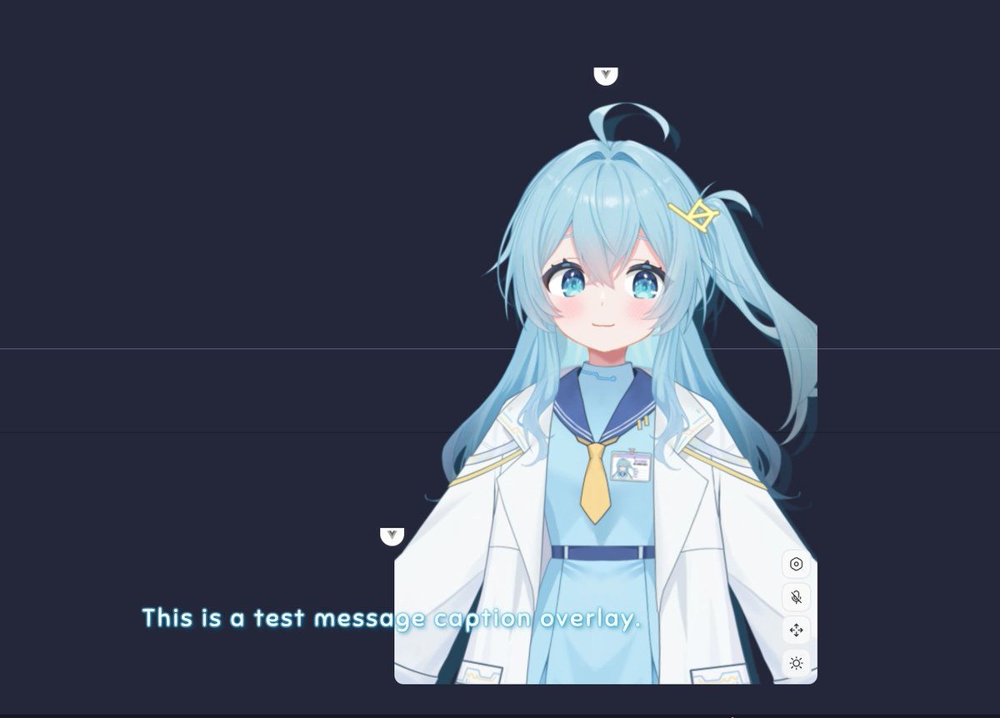
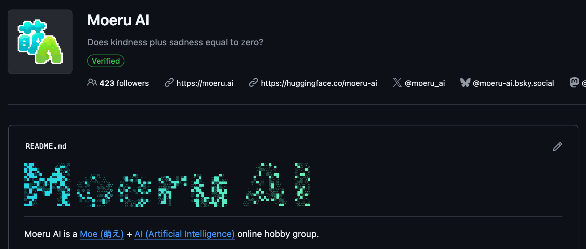
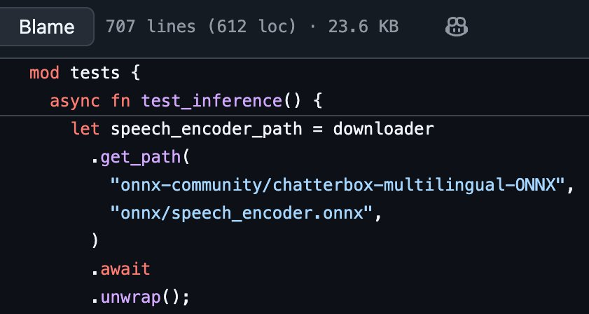

Long time no see, everyone!

AI trading bots are super hot recently—we've got similar research to share, starting with development...

## From Tauri to Electron Migration

Tauri went viral again a couple days ago. We were early adopters back in March, loved its plugin design and encapsulated tons of crates. Finally released v0.7.2 in June, but to deliver the voice chat everyone wanted, we struggled for 3 months... 3 months... wrestling with Tauri's WebKit + the painfully awkward Web Audio API and DevTools... all the way to September...

...Finally couldn't hold out anymore—switched fully to Electron over National Day!

Now, building on the original Electron foundation, we've added Linux support, introduced what we call the Control Island, and it can even overlay on the interface during full-screen mode on macOS.

Compatibility is excellent—I absolutely love it. Yesterday, we finally got the caption overlay working, so now we can have subtitles like Neuro-sama to see what the AI is outputting!

Control Island

## New Live2D Model

Sharp-eyed folks might've noticed—our model got updated! Yes, updated! I absolutely love this new model (sadly, not ready to shove it directly into the open-source repo just yet).

This model was honorably improved through collaboration with an artist who's worked with Neuro-sama's official team and a super talented modeling expert—new animated expressions are incredibly rich too

(whispering) Maybe if we get more sponsors, I'll be willing... (x

<video src="./assets/airi.mp4" alt="airi.mp4" controls></video>

## Three.js MMD Support

The models you have on hand or can find might not all be Live2D/VRM—actually, the most abundant and best ones are still MMD models.

We're also using Three.js for 3D rendering, but the reality is that Three.js no longer has a working MMD implementation. Thanks to kwaa's work, we now have a repo for this!

If you're interested too, come join us in maintaining it! [moeru-ai/three-mmd](https://github.com/moeru-ai/three-mmd)

## Velin: Write Prompts with Vue

 >"You can write prompts with [Vue](https://velin-dev.netlify.app/#/)"!

Remember back in May when we shared our own prompt library? Thanks to RainbowBird hard work and donation, Velin is now officially part of Moeru AI! Almost all of AIRI's prompts are powered by Velin—but no worries about cross-platform capabilities, Velin works great in Node.js environments too!

## Eventa: Event-Driven IPC/RPC

>"Events are all you need"

We once shared a project [netlify](https://velin-dev.netlify.app/#/) that lets you do pure local inference in the browser using Vercel AI SDK-like methods.

All these local inferences can only run in Web Workers / worker_threads, which communicate via events. Electron IPC works the same way, but we felt it wasn't elegant enough. Thanks to RainbowBird, we now have eventa—the library for driving event-based IPC/RPC implementation. [Eventa](https://github.com/moeru-ai/eventa) is now officially part of Moeru AI!

## Project Development Status

Now both Moeru AI and Project AIRI have grown into massive organizations, with over 50 original repositories covering machine learning, data processing, frontend, backend, and more—using TypeScript/Python/Rust/Go and other languages.

Total followers across all have exceeded 800 people. This was unimaginable when we first started a year ago—truly, thank you all so much for your support!

Moeru AI

Project AIRI

## Pure Rust TTS Implementation

Little teaser: Recently teamed up with kwaa to port the well-known TTS model chatterbox to a pure Rust implementation—no more worrying about tricky Python environment setup!

~5s inference per run on 4080S, absolutely love it.

Basically 1:1 recreated the Python model architecture in Rust, hoping to build it into a super streamlined local TTS inference engine leveraging other SOTA TTS models.

## Final Words

That's all for today's "one more thing"—hope you enjoyed this long thread, one after another!

We'll continue updating tomorrow, bringing you tons more goodies, introducing our explorations in VLA/VLM gaming, how we're approaching it, and what results we're seeing.
