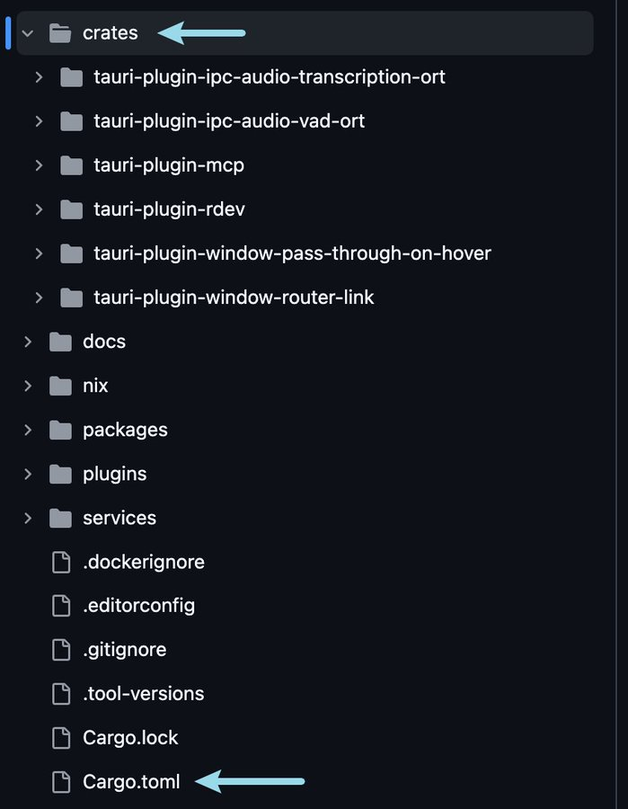
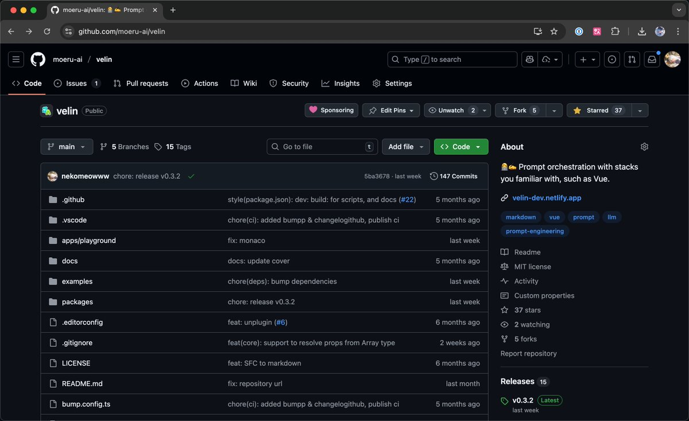
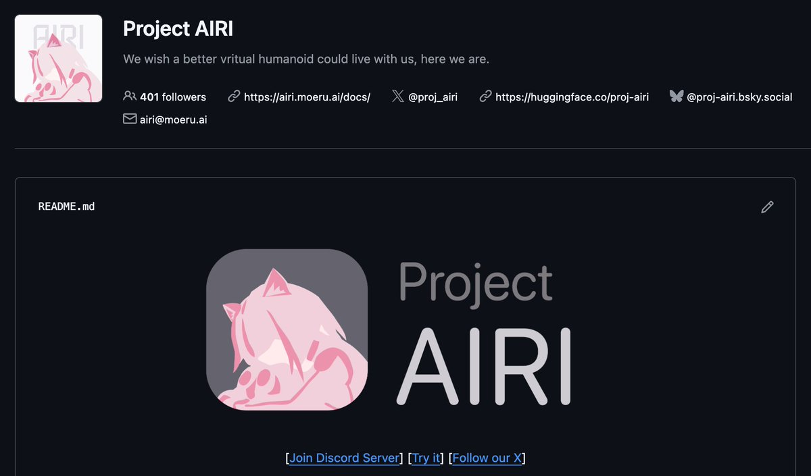

今天 AI 操盘炒币真的很火，我们也有类似的研究想和大家分享，先从开发开始聊起吧...

## 从 Tauri 到 Electron 的迁移

Tauri 前两天又火了一波，我们最早是在 3 月尝鲜的，期间因为喜欢 plugin 设计封装了许多 crate，虽然 6 月总算是发了 v0.7.2，但后面为了实现大家想要的语音对话功能，我们又顶着 Tauri 目前用的 WebKit + 巨难用 Web Audio API 和 DevTools 重构了 3 个月... 3 个月... 到了 9 月...

...最终还是憋不住，国庆彻底换了 Electron

现在 Electron 在原有的基础上，有了 Linux 的支持，添加了我们称之为的 Control Island（控制岛），甚至能在 macOS 的窗口全屏的时候也可以 overlay 在界面上

兼容性很好，孩子真的很喜欢，昨天也总算是有了 caption overlay，可以像 Neuro-sama 一样有个字幕可以看到 AI 输出了什么了

Control Island

## 新的 Live2D 模型

眼尖的伙伴可能发现了，我们的模型更新了！是的更新了！我超喜欢现在的这个模型（sadly 目前还是不想在开源仓库里直接塞这个模型）

这个模型很荣幸是找到了 Neuro-sama 官方也合作过的一位画师和非常厉害的建模老师合作改进的，新的动画表情也非常丰富

（小声）也许 sponsor 多了就愿意了（x

<video src="./assets/airi.mp4" alt="airi.mp4" controls playsinline></video>

## Three.js MMD 支持

大家手头上有的或者能找到的模型不一定是 Live2D/VRM 模型，可能最多的最好的模型还是 MMD 的

我们也是基于 Three.js 实现的 3D 渲染，然而现状是 Three.js 这边已经没有正常在工作的 MMD 实现，感谢 kwaa 的工作，我们现在有仓库做这个了

如果你也感兴趣，[请来一起维护！](https://github.com/moeru-ai/three-mmd)

## Velin：用 Vue 写提示词

>「你可以用 [Vue](https://velin-dev.netlify.app/#/) 写提示词！」

还记得 5 月份的时候我们也分享过我们自己实现的 prompt 库吗？感谢 RainbowBird 的努力和捐献，现在 Velin 也是 Moeru AI 的一员了，AIRI 几乎全部的提示词都是 Velin 驱动的，不过不用担心跨平台能力，Velin 在 Node.js 环境也可以用！

## Eventa：事件驱动的 IPC/RPC

>「事件就是你所需要的一切」

我们曾分享过 [Netlify](https://velin-dev.netlify.app/#/) ，一个允许在浏览器里用 Vercel AI SDK 类似的方式进行纯本地推理的项目

这些本地推理都只能在 Web Worker / worker_thread 中实现，而他们又都是事件通信，Electron IPC 也如此工作，但我们觉得这都不够优雅，还是感谢 RainbowBird ，用来驱动和实现基于事件的 IPC/RPC 的库，[Eventa](https://github.com/moeru-ai/eventa)，现在也是 Moeru AI 的一员了

## 项目发展现状

现在 Moeru AI 和 Project AIRI 都已经是非常庞大的组织，拥有超过 50 个原创的仓库，涵盖机器学习、数据处理、前端、后端各种领域，TypeScript/Python/Rust/Go 等多种语言

总共加起来的 follower 已经超过 800 人，这放在 1 年前我们刚创立的时候是不敢想象的，真的非常感谢大家喜欢

Moeru AI

Project AIRI

## 纯 Rust TTS 实现

小预告：最近和 kwaa 把很知名的 TTS 模型 chatterbox 迁移到了纯 Rust 实现的版本，这样就不需要担心 Python 环境不好配置的问题了

4080S 差不多 5s 推一次，很喜欢

几乎是在Rust里 1:1 对着 Python 的模型架构实现了一遍，希望能够依托其他 SOTA 的 TTS 模型变成一个很精简的本地 TTS 推理引擎

## 最后

今天的 one more thing 就到这里，希望大家喜欢这么长的一个 thread 一个接一个

我们明天会继续更新，给大家带来更多超级多的干货，给大家介绍我们在 VLA / VLM 玩游戏上，做了什么探索，如何进行，以及效果如何
